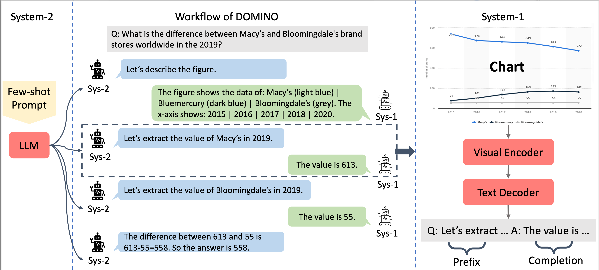

# DOMINO: A Dual-System for Multi-step Visual Language Reasoning

This is a Pytorch implementation for DOMINO: A Dual-System for Multi-step Visual Language Reasoning.

Peifeng Wang, Olga Golovneca, Armen Aghajanyan, Xiang Ren, Muhao Chen, Asli Celikyilmaz, Maryam Fazel-Zarandi

#### TL;DR: We propose a dual-system for multi-step visual language reasoning called DOMINO which outperforms existing models on challenging chart question answering datasets. 



DOMINO alternates between System-2 (a prompted LLM) and System-1 (a visual encoder-text decoder) to answer complex questions over charts. The text in blue callouts are generated by System-2. The text in green callouts are generated by System-1 and appended to the generation sequence of System-2 directly. The chart and the question are from ChartQA ([Masry et al., 2022](https://aclanthology.org/2022.findings-acl.177/)).

## Code folders

(1) `system1-vision`: Fine-tuning and inference with the vision module.

(2) `system2-lm`: Prompting LM for solving downstream tasks.

## Dependencies

- Python >= 3.6
- PyTorch == 1.12.1
- transformers == 4.29.2
- fairscale == 0.4.6
- sentencepiece == 0.1.99

## Data

We used the following datasets:
- [ChartQA](https://github.com/vis-nlp/ChartQA/tree/main/ChartQA%20Dataset)
- [PlotQA](https://github.com/NiteshMethani/PlotQA)
- [DVQA](https://kushalkafle.com/projects/dvqa.html)
- [FigureQA](https://www.microsoft.com/en-us/research/project/figureqa-dataset/)

## Fine-tuning a vision module for visual information extraction

```bash
cd system1-vision
sbatch ./scripts/finetune_deplot.sh <HOME_DIR>
```
After training, the checkpoint of the vision module is saved to `$VISION_CHECKPOINT='HOME_DIR/outputs/checkpoint'` for later use.

## Prompting LM for downstream tasks

The scripts for different tasks are stored at `system2-lm/scripts`. To run the script,
```bash
cd system2-lm
./script/run_dualsys_chartQA.sh <HOME_DIR>
```

## Citation

Please cite our paper if DOMINO is used in your work:

```bibtex 
@misc{wang2023shepherd,
      title={DOMINO: A Dual-System for Multi-step Visual Language Reasoning}, 
      author={Peifeng Wang and Olga Golovneca and Armen Aghajanyan and Xiang Ren and Muhao Chen and Asli Celikyilmaz and Maryam Fazel-Zarandi},
      year={2023},
      eprint={},
      archivePrefix={arXiv},
      primaryClass={cs.CL}
}
```